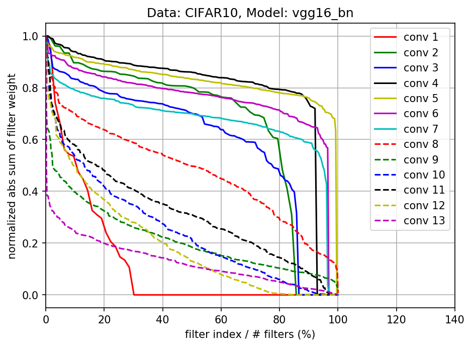
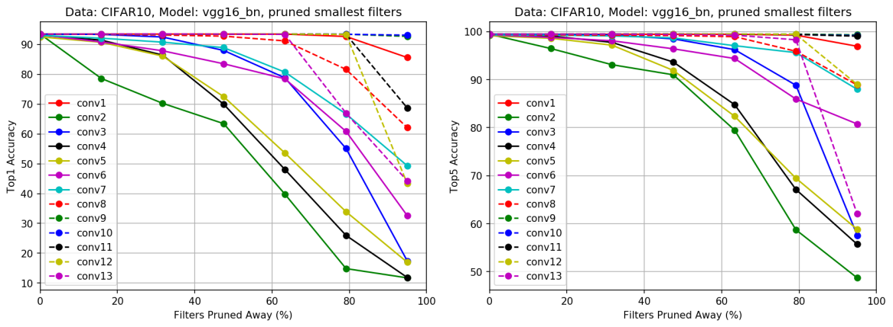
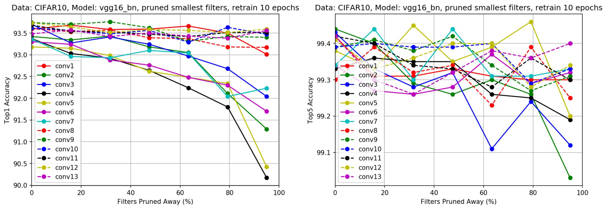

Pruning Filters For Efficient ConvNets
==
**Unofficial PyTorch implementation of pruning VGG on CIFAR-10 Data set**

**Reference**: [Pruning Filters For Efficient ConvNets, ICLR2017](https://arxiv.org/abs/1608.08710)

**Contact**: Minseong Kim (tyui592@gmail.com)


Requirements
--
* torch (version: 1.2.0)
* torchvision (version: 0.4.0)
* Pillow (version: 6.1.0)
* matplotlib (version: 3.1.1)
* numpy (version: 1.16.5)

Usage
--

### Arguments
* `--train-flag`: Train VGG on CIFAR Data set
* `--save-path`: Path to save results, ex) trained_models/
* `--load-path`: Path to load checkpoint, add 'checkpoint.pht' with `save_path`, ex) trained_models/checkpoint.pth
* `--resume-flag`: Resume the training from checkpoint loaded with `load-path`
* `--prune-flag`: Prune VGG
* `--prune-layers`: List of target convolution layers for pruning, ex) conv1 conv2
* `--prune-channels`: List of number of channels for pruning the `prune-layers`, ex) 4 14
* `--independent-prune-flag`: Prune multiple layers by independent strategy
* `--retrain-flag`: Retrain the pruned nework
* `--retrain-epoch`: Number of epoch for retraining pruned network
* `--retrain-lr`: Number of epoch for retraining pruned network

### Example Scripts

#### Train VGG on CIFAR-10 Data set
```
python main.py --train-flag --data-set CIFAR10 --vgg vgg16_bn --save-path ./trained_models/
```

#### Prune VGG by 'greedy strategy'
```
python main.py --prune-flag --load-path ./trained_models/check_point.pth --save-path ./trained_models/pruning_reuslts/ --prune-layers conv1 conv2 --prune-channels 1 1 
```

#### Prune VGG by 'independent strategy'
```
python main.py --prune-flag --load-path ./trained_models/check_point.pth --save-path ./trained_models/pruning_reuslts/ --prune-layers conv1 conv2 --prune-channels 1 1 --independent-prune-flag
```

#### Retrain the pruned network
```
python main.py --prune-flag --load-path ./trained_models/check_point.pth --save-path ./trained_models/pruning_reuslts/ --prune-layers conv1 --prune-channels 1 --retrain-flag --retrain-epoch 20 --retrain-lr 0.001
```

Results
--

#### Absolute sum of filter weights for each layer of VGG-16 trained on CIFARA-10
* This graph was created in [jupyter notebook](https://github.com/tyui592/notepad/blob/master/pruning_filters_for_efficient_convets/prune_filter_for_efficient_convnets.ipynb). You can make the graph yourself.



#### Pruning filters with the lowest absolute weights sum and their corresponding test accuracies on CIFAR-10
* This graph was created in [jupyter notebook](https://github.com/tyui592/notepad/blob/master/pruning_filters_for_efficient_convets/prune_filter_for_efficient_convnets.ipynb). You can make the graph yourself.



#### Prune and retrain for each single layer of VGG-16 on CIFAR-10
* This graph was created in [jupyter notebook](https://github.com/tyui592/notepad/blob/master/pruning_filters_for_efficient_convets/prune_filter_for_efficient_convnets.ipynb). You can make the graph yourself.


